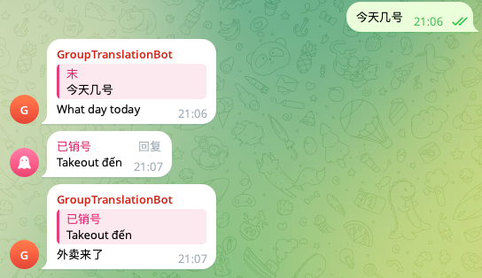
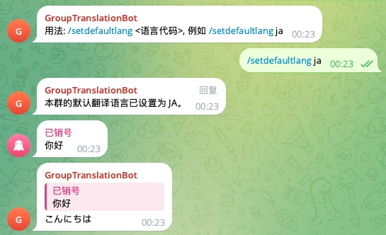

# telegram-translation-bot
telegram bot, 默认情况下，所有消息都会被翻译成中文。

👤 个人设置:
给机器人发送消息, 比如：
/setlang en, 那么你发送的消息均会翻译成英文。
/getlang - 查看你的个人设置。



👑 群组管理员设置:
在群组里发送消息，比如：
/setdefaultlang ja - 将本群的默认翻译语言设为日语。


# node 版本 
- 22.16.0

# 安装依赖
```bash
npm i -g pnpm

pnpm install

```

# 运行
.env 文件 添加机器人token 
TELEGRAM_BOT_TOKEN=xxx

```bash 
  pnpm build && pnpm start
```